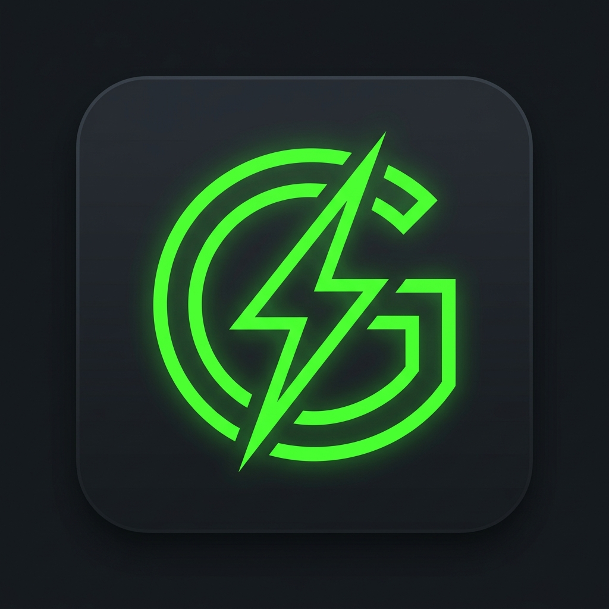

<div align="center">
  
  <h1>Gware Language Engine</h1>
  <p>A lightning-fast, zero-dependency scripting language and web transcompiler written entirely in C.</p>
</div>

---

## ⚡ What is Gware?

Gware is a micro-language built with one primary goal: blazing fast execution with a near-zero memory footprint. 

But it's not just a language—it's a two-in-one powerhouse:
1. **Gware Scripting**: A dynamically typed (with optional hybrid static typing!) language supporting strings, operator precedence, and control flow for general-purpose computing.
2. **GwareWeb**: A Single-Language Web Transcompiler. Write your frontend components, state, actions, and styles in a `.gweb` file, and compile it directly into a standalone `index.html` file that is ready to deploy!

---

## 🚀 Features

* **Hybrid Type System:** Opt-in to strict type-safety with `set int age = 30` or stay completely dynamic with `set age = 30`.
* **Zero Dependencies:** Written entirely in C, with no reliance on heavy runtimes (no Node, no Python, no JVM).
* **Instant Compilation:** Compiles in less than a second using Zig as a C compiler.
* **GwareWeb Transpiler:** Stop writing HTML, CSS, and JS separately. Write reactive components in a `.gweb` file and let Gware build the web for you.

---

## 🛠️ Usage

### Standard Scripting (.gw)

Create a `test.gw` file:
```text
show("Welcome to Gware!")

set int math = 10 + 5 * 2
if math == 20 {
    show("Operator Precedence works!")
}

set count = 3
while count > 0 {
    show(count)
    set count = count - 1
}
```

Run it via the CLI:
```bash
./gware.exe test.gw
```

---

### Web Transpiling (.gweb)

<div align="center">
  
</div>

Create a `counter.gweb` file:
```text
component Button {
    set int clicks = 0
    
    action increment {
        set clicks = clicks + 1
    }

    style {
        background: "blue"
        color: "white"
        padding: "10px 20px"
        cursor: "pointer"
    }

    view {
        button(onClick: increment) {
            show("Clicks: ")
            show(clicks)
        }
    }
}
```

Compile it to a reactive `index.html`:
```bash
./gware.exe --web counter.gweb
```

---

## 🏗️ Building from Source

Gware requires a standard C compiler. We use **Zig** (`zig cc`) as our preferred zero-dependency build tool.

```bash
# Windows
.\build.bat
```

## 📜 License

This project is licensed under the MIT License - see the [LICENSE](LICENSE) file for details.
